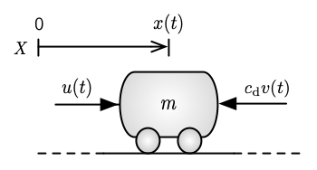

# PID 101 for Robotics

The proportional-integral-derivative (PID) control structure is widely used but sometimes blindly applied and poorly understood.  These two notebooks—with sample code and examples written in Python—provide a concise and _systematic_ introduction to PID control.  Students and practitioners in robotics are the intended audience, although the concepts are applicable more broadly.

## Part I: Basics

The first notebook (Part I) provides a hands-on introduction to the feedback control of simple single-input, single-output (SISO) systems.  What is perhaps unique about this notebook is that we introduce PID control solely in the time domain (i.e., without reliance on Laplace domain techniques), which is arguably more intuitive.

>Let $x(t)\in\mathbb{R}$ be the system state to be controlled and suppose that the control objective is to use the system input $u(t)\in\mathbb{R}$ to drive $x(t)\rightarrow x_{\rm d}$ as $t\rightarrow\infty$ with some desired transient performance.  To this end, a PID controller takes the general form
>
>$$u(t)=k_{{\rm P}}(x_{\textup{d}}-x(t)) + k_{{\rm I}}\int_0^t(x_{\textup{d}}-x(\tau))d\tau + k_{{\rm D}}\frac{\textup{d}}{\textup{d}t}(x_{\textup{d}}-x(t)),$$
>
>where $k_{{\rm P}},k_{{\rm I}},k_{{\rm D}}\in\mathbb{R}$ are the proportional, integral, and derivative controller gains, respectively.

This notebook (Part I) employs a simple 1D mobile robot example to illustrate the role that each term plays in the PID control structure.

### Main File(s)

* [PID-101-Part1.ipynb](PID-101-Part1.ipynb) (Jupyter notebook)

## Part II: Tuning

This second notebook introduces one practical way for choosing PID gains (i.e., _tuning_).  The approach is particularly well suited to robotics applications where we usually want the tracking error for step inputs to be zero and we would like the closed-loop response to have high damping (i.e., avoids oscillations).  Moreover, the technique allows for very easy tuning by a single parameter that merely selects the desired closed-loop bandwidth $\omega_{\textup{CL}}>0$ of the system.  

A vehicle cruise control example and a DC motor speed control example are employed to show how to select and tune the derived controller design for first- and second-order systems, respectively.

### Main File(s)

* [PID-101-Part2.ipynb](PID-101-Part2.ipynb) (Jupyter notebook)

## Contact the Author

[Joshua A. Marshall](https://offroad.engineering.queensu.ca/people/joshua-marshall/), PhD, PEng  
[Ingenuity Labs Research Institute](https://ingenuitylabs.queensu.ca)  
Queen's University  
Mitchell Hall, Room 395  
Kingston, ON K7L 3N6 Canada  

## License

Source code examples in this notebook are subject to an [MIT License](LICENSE).
